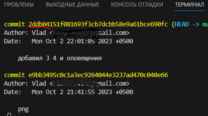

# Инструкция

## 1. Первый запуск
При первом использовании Git необходимо представиться.

Для этого нужно ввести в терминале 2 команды:

git config --global user.name «Ваше имя английскими буквами»

git config --global user.email ваша почта@example.com

## 2.Инициализация репозитория
Для того, чтобы начать сохранять в этой папке файлы нужно в вести в терминал 1 команду:

git init

## 3.Написание текста
для заголока перед словом поставьте решётку:  # text

Для подзаголовка поставьте две решётки : ## text

оповещения

подробно про текст можно посмотреть [тут](https://learn.microsoft.com/ru-ru/contribute/content/markdown-reference)

## 4. Сохранение изменений
если есть кружок рядом с назанием файла, то нажать ctrl + s

ввести в терминал 2 команды:

git add название файла

git commit - m "коменарий к сохранению" или их слияние

git commit -am "коментарий к сохранению"

## 5. Просмотр сохранений(коммитов)
 Чтобы посмотреть историю сохранений нужно написать в терминал это :

 git log

## 6.Перемещение между сохранениями 
что бы переместиться на ранний коммит нужно сначало сохранить последние изменения, узнать номер коммита с помощью гит лог

и написать
git checkout и эти первые 5 символов

чтобы вернуться на самый последний коммит написать

 git checout и название ветки, в которой находится этот последний коммит
## 7. добавление файла в игнор
Чтобы гит игнорировал любой фаил, например картинку, нужно в проводнике создать файл с названием .gitignore, а в нём написать название файла с расширением и сохранить